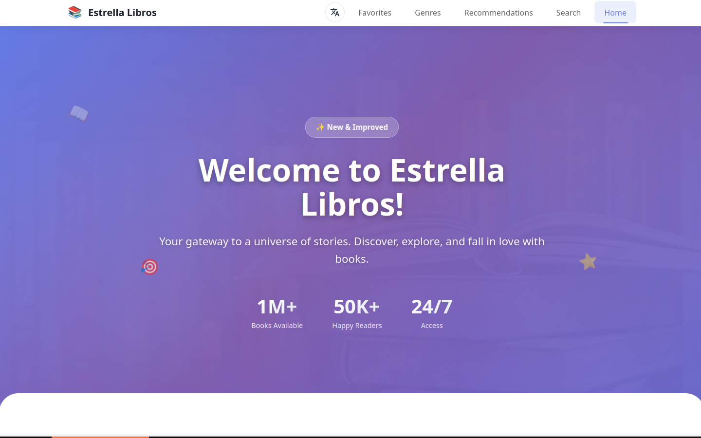
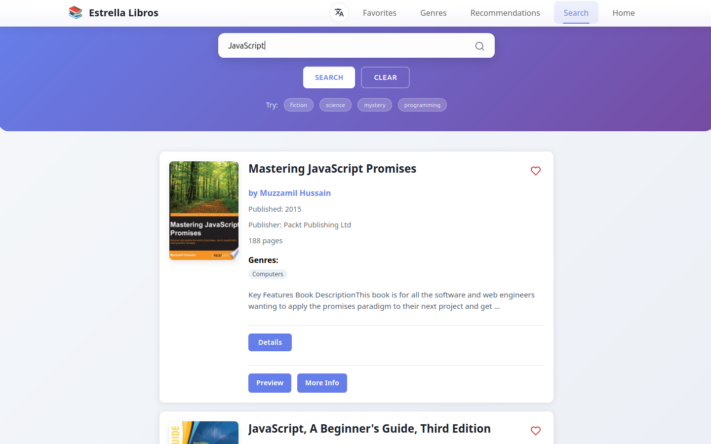
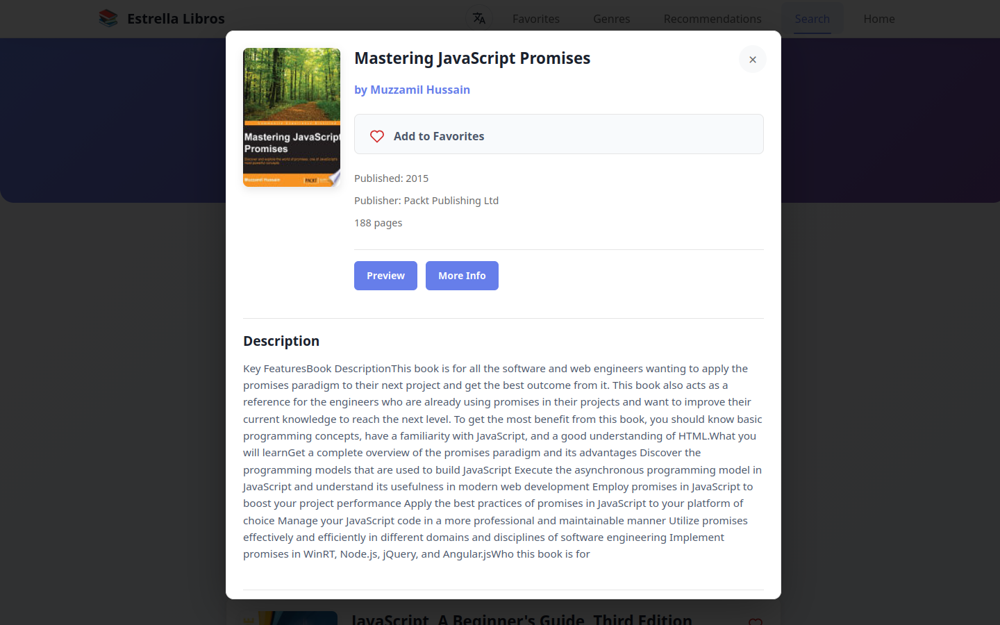
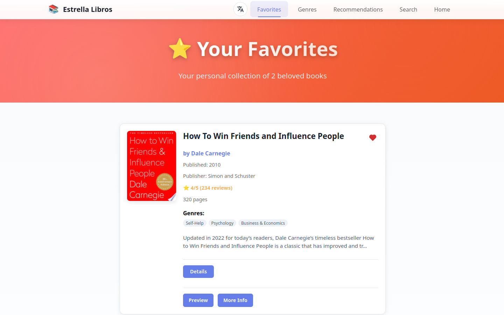
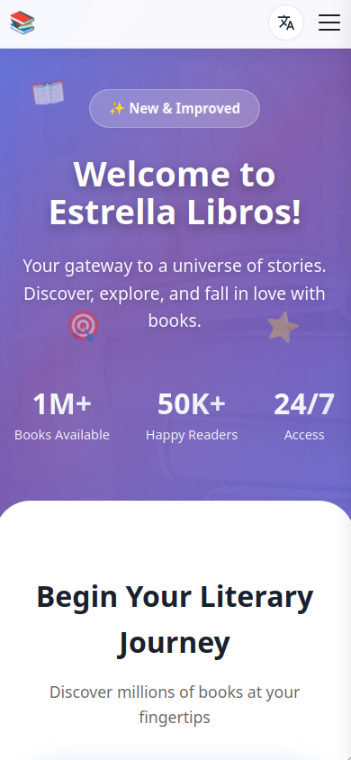

# Estrella Libros

Estrella Libros is a multilingual Progressive Web Application for discovering, exploring, and saving books through the Google Books API.

Users can search books, explore detailed information, save favorites, switch interface languages, install the application as a PWA, and continue using previously cached content when connectivity is limited.

## Live demo

https://fluffy-platypus-9cfc3e.netlify.app

## Screenshots

### Home page



### Search results



### Book details



### Favorites



### Mobile UI



## Features

* Search books through the Google Books API
* View normalized book details
* Save and manage favorite books
* Persist favorites in localStorage
* Switch UI language between English, Russian, and Spanish
* Detect language from query string, localStorage, browser settings, and cookies
* Install the application as a Progressive Web App
* Cache API responses and book cover images for improved repeat visits
* Handle loading, error, empty, timeout, and offline states
* Responsive layout for desktop, tablet, and mobile devices
* Unit and React Testing Library coverage for core application flows

## Tech Stack

* React
* TypeScript
* Vite
* React Router
* TanStack Query
* Zustand
* i18next / react-i18next
* Google Books API
* SCSS
* Vite PWA
* Jest
* React Testing Library
* Netlify

## Architecture Overview

The application follows a feature-oriented React SPA architecture built around reusable UI components, isolated business logic, and centralized state management.

High-level structure:

```txt
src/
  api/          external API clients
  config/       environment and API config
  features/     reusable feature components, domain types, and query contracts
  hooks/        reusable behavior hooks
  pages/        route-level pages
  store/        Zustand state
  utils/        data cleanup and helper functions
  widgets/      larger layout blocks
```

Core responsibilities are separated between API integration, state management, localization, routing, and UI rendering to keep the codebase maintainable and easy to extend.

## Google Books API and Server State

The Google Books integration is split into two layers:

* `src/api/googleBooksApi.ts` contains low-level API functions for searching books and fetching book details.
* `src/features/books/bookQueries.ts` defines TanStack Query contracts for search, details, prefetching, and favorite book detail queries.

Responsibilities include:

* searching books by query
* fetching a book by id
* validating the minimal API response shape at the API boundary
* normalizing raw Google Books responses into application book models
* managing loading, error, retry, stale, and cached server state through TanStack Query
* prefetching book details on user intent
* supporting multiple favorite book detail queries with `useQueries`

The API key is provided through an environment variable.

## State Management

Favorites are managed with Zustand.

The favorites store:

* keeps favorite book ids in a `Set`
* exposes selectors for favorite state
* supports toggling and clearing favorites
* persists data to localStorage
* restores persisted ids after reload
* uses Zustand middleware: `persist`, `devtools`, and `immer`

This allows favorite books to remain available across browser sessions without additional infrastructure.

## Internationalization

The interface supports:

* English
* Russian
* Spanish

Localization is implemented with `i18next`, `react-i18next`, `i18next-http-backend`, and `i18next-browser-languagedetector`.

Language detection order:

```txt
querystring -> localStorage -> navigator -> cookie
```

Translation files are loaded from:

```txt
/locales/{{lng}}/{{ns}}.json
```

## PWA

The application includes Progressive Web App support through `vite-plugin-pwa`.

Implemented capabilities:

* web app manifest
* installable application experience
* auto-updating service worker
* runtime caching for Google Books API requests
* runtime caching for book cover images
* cleanup of outdated caches

Caching strategy:

* Google Books API: `NetworkFirst`
* Book cover images: `CacheFirst`

These strategies improve repeat visits, support installation on supported devices, and provide access to previously cached content when connectivity is limited.

## Testing

The project includes unit and React Testing Library tests.

Covered areas include:

* TanStack Query based book search, details, favorites, and recommendations flows
* PWA install hook
* recommendations hook
* favorites store
* search UI
* book cards
* book details modal
* favorites page
* language menu
* offline banner
* header
* collection pages
* genre pages
* recommendations page

Quality commands:

```bash
npm run lint
npm run build
npm run test
npm audit
```

Current project status:

```txt
Lint: passing
Build: passing
Tests: passing
```

## Getting Started

### 1. Clone the repository

```bash
git clone https://github.com/MionFF/estrella-libros.git
cd estrella-libros
```

### 2. Install dependencies

```bash
npm install
```

### 3. Create environment file

Create `.env.local` from `.env.example`:

```bash
cp .env.example .env.local
```

Add your Google Books API key:

```txt
VITE_GOOGLE_BOOKS_API_KEY=your_api_key_here
```

You can create a key in Google Cloud Console.

### 4. Start development server

```bash
npm run dev
```

Open:

```txt
http://localhost:5173
```

## Available Scripts

```bash
npm run dev
npm run build
npm run preview
npm run lint
npm run test
npm run test:watch
npm run test:coverage
```

## Engineering Focus

The project demonstrates:

* external API integration
* server-state management with TanStack Query
* client-side routing
* state management with Zustand
* internationalization
* Progressive Web App architecture
* responsive UI development
* automated testing with Jest and React Testing Library

The application uses Google Books API as its primary data source and persists user preferences locally to provide a fast and lightweight user experience.